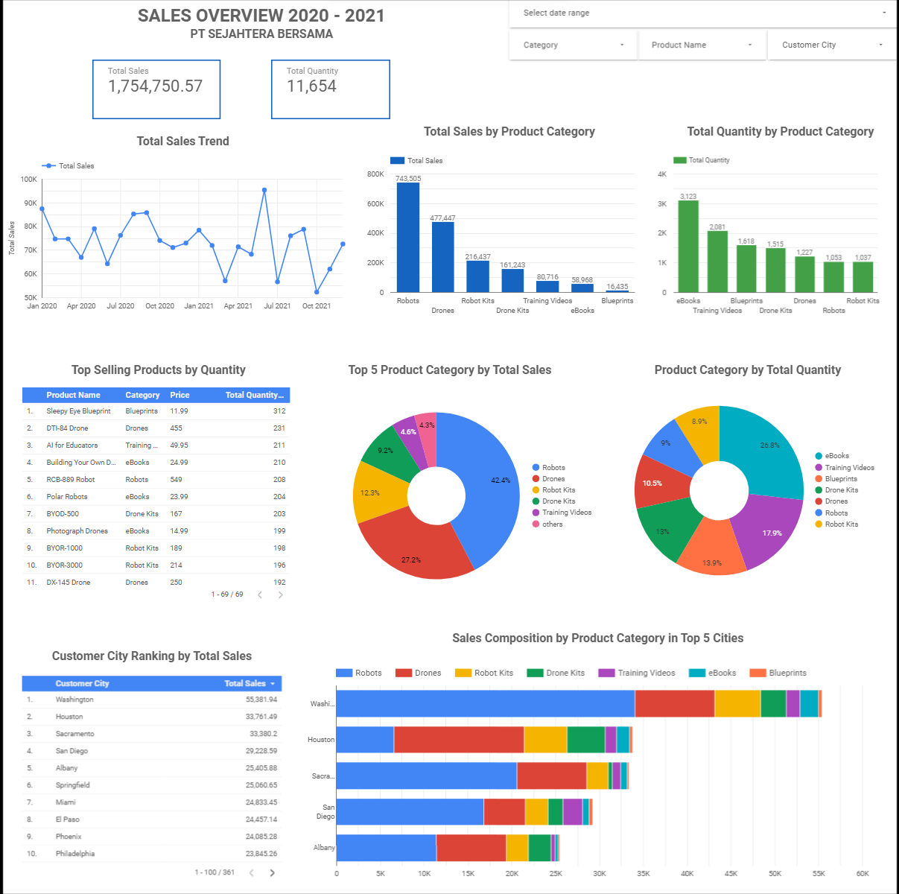

# Final-Project-of-VIX-BI-Analyst-at-Bank-Muamalat

## Overview
Repositori ini berisi proyek akhir untuk Program Virtual Intership sebagai BI Analyst di Bank Muamalat x Rakamin Academy. Proyek ini berfokus pada analisis dan visualisasi data penjualan PT Sejahtera Bersama. Melibatkan berbagai tugas seperti menentukan primary key pada 4 tabel yang ada di dataset penjualan yaitu tabel customers, tabel orders, tabel products dan tabel produccategory, kemudian menetapkan hubungan antar tabel, membuat tabel master, mengembangkan dashboard interaktif menggunakan Looker, mencari insigh serta memberikan rekomendasi untuk perusahaan.

## Tujuan
Tujuan dari proyek ini adalah untuk menunjukkan keahlian dalam analisis data, SQL, dan alat visualisasi data seperti Looker. Dengan menyelesaikan tugas-tugas dan menghasilkan insight dan rekomendasi yang berharga, proyek ini menampilkan kemampuan untuk menggunakan data untuk mendukung proses pengambilan keputusan dalam lingkungan bisnis.

## Tugas Proyek
1. Menentukan primary key untuk empat tabel dalam dataset penjualan
2. Menetapkan hubungan antar tabel
3. Membuat tabel master dengan menggabungkan empat tabel awal
4. Mengembangkan dashboard interaktif menggunakan Looker untuk visualisasi data
5. Mendapatkan insight yang berarti dari visualisasi tersebut
6. Memberikan rekomendasi yang actionable untuk meningkatkan strategi penjualan PT Sejahtera Bersama.

## Pengerjaan Tugas 1-5
  ### Tugas 1: Penentuan Primary Key
1. Tabel Customer:
   - Primary Key: CustomerID

2. Tabel Products:
   - Primary Key: ProdNumber

3. Tabel Orders:
   - Primary Key: OrderID

4. Tabel ProductCategory:
   - Primary Key: CategoryID

### Tugas 2: Hubungan Antar Tabel

1. Hubungan antara "Customers" dan "Orders":
   - Tabel "Customers" memiliki primary key CustomerID.
   - Tabel "Orders" memiliki kolom CustomerID sebagai foreign key yang mengacu pada nilai CustomerID dalam tabel "Customers".
   - Hubungan ini dapat disebut sebagai "one-to-many" karena satu pelanggan dalam tabel "Customers" dapat memiliki banyak pesanan dalam tabel "Orders", tetapi setiap pesanan hanya terkait dengan satu pelanggan.

2. Hubungan antara "Orders" dan "Products":
   - Tabel "Products" memiliki primary key ProdNumber.
   - Tabel "Orders" memiliki kolom ProdNumber sebagai foreign key yang mengacu pada nilai ProdNumber dalam tabel "Products".
   - Hubungan ini dapat disebut sebagai "many-to-one" karena banyak pesanan dalam tabel "Orders" dapat menggunakan produk yang sama dari tabel "Products", tetapi setiap produk hanya memiliki satu entri (pesanan) dalam tabel "Orders".

3. Hubungan antara "Products" dan "ProductCategory":
   - Tabel "ProductCategory" memiliki primary key CategoryID.
   - Tabel "Products" memiliki foreign key Category yang mengacu pada nilai CategoryID dalam tabel "ProductCategory".
   - Hubungan ini dapat disebut sebagai "many-to-one" karena banyak produk dalam tabel "Products" termasuk dalam satu kategori tertentu dalam tabel "ProductCategory", tetapi setiap kategori hanya memiliki satu entri (produk) dalam tabel "Products".

### Tugas 3: Pembuatan Tabel Master PT Sejahtera Bersama

Langkah-langkah untuk membuat tabel master PT Sejahtera Bersama adalah sebagai berikut:

1. **Impor Data ke Google BigQuery:** 
   - Import dataset penjualan yang terdiri dari 4 tabel: Customers, Orders, Products, dan ProductCategory ke Google BigQuery untuk pengolahan dan analisis data.

2. **Query dengan Melakukan Join Tabel:** 
   - Buat query SQL untuk menggabungkan keempat tabel berdasarkan hubungan kunci antar tabel menggunakan Primary Key. Hal ini memungkinkan kita untuk menggabungkan informasi dari tabel-tabel tersebut menjadi satu tabel besar.

3. **Pilih Kolom-kolom Sesuai Kriteria dan Buat Alias pada Nama Kolom:** 
   - Pilih kolom-kolom yang diperlukan untuk membentuk tabel master sesuai dengan kriteria yang telah ditetapkan, seperti CustomerEmail, CustomerCity, Date, Quantity, ProdName, Price, CategoryName, dan total_sales.
   - Untuk kolom total_sales, hitung nilainya dengan mengalikan kolom Quantity/order_qty dengan kolom Price/product_price.

4. **Urutkan Data Berdasarkan Tanggal Transaksi:** 
   - Gunakan fungsi ORDER BY untuk mengurutkan data berdasarkan kolom order_date secara ascending (dari tanggal transaksi paling awal sampai paling akhir).

5. **Tabel Data Master Siap untuk Diunduh:** 
   - Setelah langkah-langkah di atas dilakukan, tabel data master telah selesai dan siap untuk diunduh. Tabel ini dapat digunakan untuk analisis lebih lanjut dan pembuatan visualisasi data.

Berikut adalah syntax SQL yang digunakan untuk langkah 2, 3 dan 4:

```sql
SELECT
o.Date AS order_date,
pc.CategoryName AS category_name,
p.ProdNamea AS product_name,
p.Price AS product_price,
o.Quantity AS order_qty,
(p.Price * p.Quantity) AS total_sales,
c.CustomerEmail AS cust_email,
c.CustomerCity AS cust_city
FROM Final_Task.Customers AS c
JOIN Final_Task.Orders AS o ON c.CustomerID = o.CustomerID
JOIN Final_Task.Products as p ON o.ProdNumber = p.ProdNumber
JOIN Final_Task.ProductCategory AS pc ON p.Category = pc.CategoryID
ORDER BY order_date ASC;
```
### Tugas 4: Mengembangkan dashboard interaktif menggunakan Looker untuk menampilkan visualisasi data
Di bawah ini adalah tampilan dashboard sales overview PT Sejahtera bersama:


#### Insight
Berikut adalah beberapa insight yang dapat diambil dari visualisasi pada dashboard:

1. Total penjualan secara kumulatif selama periode Januari 2020 hingga Desember 2021 mencapai $1.754.750 dengan total jumlah barang terjual dari semua kategori sebanyak 11.654 buah.

2. Analisis tren menunjukkan bahwa penjualan tertinggi terjadi pada bulan Juni 2021, sementara penjualan terendah tercatat pada bulan Oktober 2021.

3. Kategori "Robots" berkontribusi paling banyak pada total penjualan, diikuti oleh "Drones," "Robot Kits," "Drone Kits," "Training Videos," "eBooks," dan terakhir "Blueprints."

4. Berdasarkan total kuantitas terjual, kategori "eBooks" muncul sebagai kategori dengan penjualan terbanyak, diikuti oleh "Training Videos," "Blueprints," "Drone Kits," "Drones," "Robots," dan "Robot Kits."

5. "Sleepy Eye Blueprint" adalah produk yang paling diminati oleh pelanggan sehingga paling banyak terjual.

6. Lima kota pelanggan dengan total penjualan tertinggi, secara berurutan adalah, "Washington," "Houston," "Sacramento," "San Diego," dan "Albany."

7. Dari proporsi masing-masing produk di lima kota teratas, tergambar bahwa kategori produk "Robots" merupakan produk yang paling banyak terjual di kota Washington, Sacramento, San Diego, dan Albany. Sementara itu, di kota Houston, produk pada kategori "Drones" memiliki penjualan yang lebih tinggi dibandingkan dengan empat kota lainnya.


### Tugas 5: Melakukan analisis terhadap visualisasi data untuk memberikan rekomendasi yang relevan.
#### Rekomendasi:
Beberapa rekomendasi yang dapat diusulkan kepada manajemen perusahaan PT Sejahtera Bersama untuk meningkatkan penjualan:

1. Meningkatkan stok dan ketersediaan produk "Sleepy Eye Blueprint" sebagai produk yang paling diminati dan terjual dengan baik.
2. Fokus pada pengembangan produk dalam kategori eBooks, Training Videos, dan Blueprints yang paling banyak terjual.

3. Lakukan analisis mendalam mengenai pelanggan yang membeli produk kategori Robots, Drones, dan Robot Kits. Analisis ini dilakukan karena ketiga kategori ini memiliki kontribusi paling tinggi pada total pendapatan, tetapi memiliki kuantitas yang lebih rendah. Potensi penyebabnya adalah harga produk yang mahal sehingga hanya dijangkau oleh sebagian kalangan masyarakat, serta promosi yang belum optimal. 
   Perusahaan perlu lebih mendalam dalam menggali karakteristik pelanggan untuk ketiga kategori ini, seperti gender, pendapatan, usia, dan faktor-faktor lain yang berpengaruh. Data tersebut akan membantu dalam menentukan strategi pemasaran yang tepat dan sesuai dengan segmentasi pelanggan.

4. Mengaplikasikan strategi pemasaran khusus untuk produk kategori Robots di kota Washington, Sacramento, San Diego, dan Albany yang memiliki penjualan dominan. Gunakan promo dan diskon personalisasi untuk menarik lebih banyak pelanggan potensial dan meningkatkan loyalitas pelanggan lama.

5. Perkuat pemasaran produk kategori "Drones" di kota Houston yang memiliki penjualan paling tinggi diantara top 5 kota dengan total penjualan terbanyak. Identifikasi preferensi pelanggan terkait produk "Drones" di kota ini untuk menyusun strategi pemasaran yang lebih efektif.

6. Lakukan analisis lebih mendalam terkait preferensi dan perilaku pelanggan di tiap kota, mengingat preferensi kategori produk yang berbeda-beda. Oleh karena itu, perusahaan sebaiknya menyusun strategi penjualan yang dipersonalisasi dan disesuaikan dengan kebutuhan pelanggan di masing-masing kota sehingga distribusi produk akan lebih tepat sasaran dan efektif dalam mencapai target penjualan di masing-masing wilayah.

7. Pertimbangkan untuk menawarkan produk secara bundling dengan kombinasi kategori produk yang sama atau berbeda untuk mendorong peningkatan penjualan. Dengan menawarkan produk secara bundling, perusahaan dapat menarik perhatian pelanggan dengan memberikan nilai tambah dan keuntungan ekonomi bagi mereka. Selain itu, bundling juga dapat meningkatkan rata-rata nilai pesanan (average order value) karena pelanggan cenderung membeli lebih dari satu produk dalam satu paket bundling. Hal ini dapat mendorong penjualan keseluruhan dan meningkatkan loyalitas pelanggan.


### Project Files
- [Link Google Sheet](https://docs.google.com/spreadsheets/d/1GI4YFa3cE87rI35UBNYVnAsFaVsaT8HvkpfqrAEzCpg/edit?usp=drive_link) - Raw data penjualan yang digunakan untuk analisis.
- [Link Looker Dashboard](https://lookerstudio.google.com/s/vHJehnkFVRQ) - Dashboard, visualisasi data di Looker Studio.

### Alat yang Digunakan
- Google BigQuery untuk analisis dan manipulasi data.
- Looker untuk visualisasi data interaktif.
